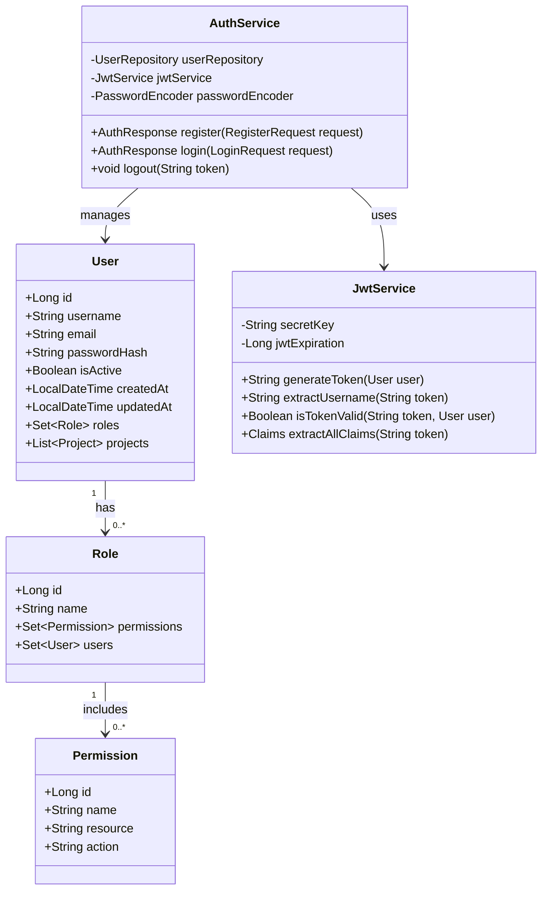
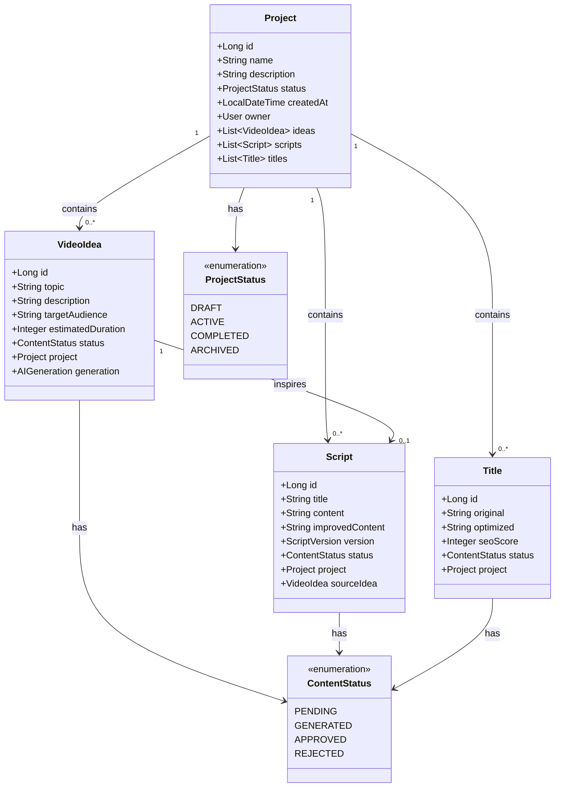
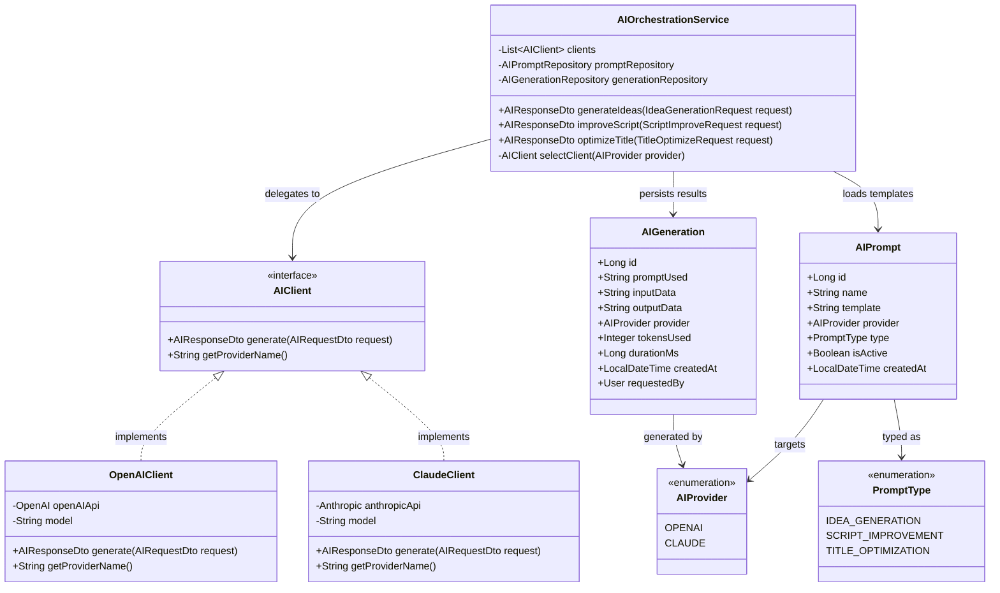

# 📘 Documentation Technique — Armin

> Application SaaS de gestion de contenu pour créateurs, propulsée par l'IA.  
> Backend : **Spring Boot** | Architecture : **MVC / Layered Architecture** | Auth : **JWT**

---

## Table des matières

1. [Vue d'ensemble de l'architecture](#1-vue-densemble-de-larchitecture)
2. [Structure des packages](#2-structure-des-packages)
3. [Diagrammes de classes](#3-diagrammes-de-classes)
4. [Entités JPA](#4-entités-jpa)
5. [API REST](#5-api-rest)
6. [Sécurité](#6-sécurité)

---

## 1. Vue d'ensemble de l'architecture

### 1.1 Architecture en couches

Armin suit une architecture **MVC en couches strictes**, garantissant la séparation des responsabilités et la maintenabilité du code.

```
┌─────────────────────────────────────────────────────────────┐
│                        CLIENT (HTTP)                        │
└─────────────────────────┬───────────────────────────────────┘
                          │
┌─────────────────────────▼───────────────────────────────────┐
│                   COUCHE CONTROLLER                         │
│         REST Controllers — Validation des entrées           │
│         Gestion des DTOs — Codes de réponse HTTP            │
└─────────────────────────┬───────────────────────────────────┘
                          │
┌─────────────────────────▼───────────────────────────────────┐
│                    COUCHE SERVICE                           │
│         Logique métier — Orchestration des appels IA        │
│         Transactions — Règles de validation métier          │
└──────────────┬──────────────────────────┬───────────────────┘
               │                          │
┌──────────────▼──────────┐  ┌────────────▼──────────────────┐
│   COUCHE REPOSITORY     │  │      COUCHE AI CLIENT         │
│   Spring Data JPA       │  │   OpenAI / Claude API         │
│   Accès base de données │  │   Génération de contenu       │
└──────────────┬──────────┘  └───────────────────────────────┘
               │
┌──────────────▼──────────────────────────────────────────────┐
│                  BASE DE DONNÉES (PostgreSQL)               │
└─────────────────────────────────────────────────────────────┘
```

### 1.2 Pattern architectural — MVC

| Composant    | Responsabilité                                              | Technologie               |
|--------------|-------------------------------------------------------------|---------------------------|
| **Model**    | Entités JPA, DTOs, mappers                                  | Hibernate / MapStruct     |
| **View**     | Réponses JSON structurées                                   | Jackson / Spring MVC      |
| **Controller** | Réception des requêtes HTTP, délégation aux services     | Spring Web MVC            |
| **Service**  | Logique métier, appels IA, transactions                     | Spring Service / @Transactional |
| **Repository** | Accès et persistance des données                         | Spring Data JPA           |

### 1.3 Technologies principales

| Technologie        | Version  | Usage                              |
|--------------------|----------|------------------------------------|
| Spring Boot        | 3.x      | Framework principal                |
| Spring Security    | 6.x      | Authentification & autorisation    |
| Spring Data JPA    | 3.x      | ORM et accès base de données       |
| PostgreSQL         | 15+      | Base de données relationnelle      |
| JWT (jjwt)         | 0.12.x   | Tokens d'authentification         |
| OpenAI Java SDK    | 1.x      | Client API OpenAI                  |
| Anthropic SDK      | 0.x      | Client API Claude                  |
| MapStruct          | 1.5.x    | Mapping DTO ↔ Entités             |
| Lombok             | 1.18.x   | Réduction du boilerplate           |

---

## 2. Structure des packages

```
com.armin/
├── auth/
│   ├── controller/
│   │   └── AuthController.java
│   ├── service/
│   │   ├── AuthService.java
│   │   └── JwtService.java
│   ├── dto/
│   │   ├── LoginRequest.java
│   │   ├── RegisterRequest.java
│   │   └── AuthResponse.java
│   └── filter/
│       └── JwtAuthenticationFilter.java
│
├── users/
│   ├── controller/
│   │   └── UserController.java
│   ├── service/
│   │   └── UserService.java
│   ├── repository/
│   │   └── UserRepository.java
│   ├── entity/
│   │   ├── User.java
│   │   ├── Role.java
│   │   └── Permission.java
│   └── dto/
│       ├── UserDto.java
│       └── UserUpdateRequest.java
│
├── projects/
│   ├── controller/
│   │   └── ProjectController.java
│   ├── service/
│   │   └── ProjectService.java
│   ├── repository/
│   │   └── ProjectRepository.java
│   ├── entity/
│   │   └── Project.java
│   └── dto/
│       ├── ProjectDto.java
│       ├── ProjectCreateRequest.java
│       └── ProjectUpdateRequest.java
│
├── content/
│   ├── ideas/
│   │   ├── controller/
│   │   │   └── VideoIdeaController.java
│   │   ├── service/
│   │   │   └── VideoIdeaService.java
│   │   ├── repository/
│   │   │   └── VideoIdeaRepository.java
│   │   ├── entity/
│   │   │   └── VideoIdea.java
│   │   └── dto/
│   │       ├── VideoIdeaDto.java
│   │       └── IdeaGenerationRequest.java
│   ├── scripts/
│   │   ├── controller/
│   │   │   └── ScriptController.java
│   │   ├── service/
│   │   │   └── ScriptService.java
│   │   ├── repository/
│   │   │   └── ScriptRepository.java
│   │   ├── entity/
│   │   │   └── Script.java
│   │   └── dto/
│   │       ├── ScriptDto.java
│   │       └── ScriptImproveRequest.java
│   └── titles/
│       ├── controller/
│       │   └── TitleController.java
│       ├── service/
│       │   └── TitleService.java
│       ├── repository/
│       │   └── TitleRepository.java
│       ├── entity/
│       │   └── Title.java
│       └── dto/
│           ├── TitleDto.java
│           └── TitleOptimizeRequest.java
│
├── ai/
│   ├── client/
│   │   ├── AIClient.java                  (interface)
│   │   ├── OpenAIClient.java
│   │   └── ClaudeClient.java
│   ├── service/
│   │   └── AIOrchestrationService.java
│   ├── entity/
│   │   ├── AIPrompt.java
│   │   └── AIGeneration.java
│   ├── repository/
│   │   ├── AIPromptRepository.java
│   │   └── AIGenerationRepository.java
│   └── dto/
│       ├── AIRequestDto.java
│       └── AIResponseDto.java
│
└── common/
    ├── config/
    │   ├── SecurityConfig.java
    │   ├── OpenAIConfig.java
    │   ├── ClaudeConfig.java
    │   └── JpaAuditConfig.java
    ├── exception/
    │   ├── GlobalExceptionHandler.java
    │   ├── ResourceNotFoundException.java
    │   ├── UnauthorizedException.java
    │   └── AIServiceException.java
    └── util/
        ├── PromptBuilder.java
        └── ContentSanitizer.java
```

---

## 3. Diagrammes de classes

### 3.1 Modèle Utilisateur et Authentification



### 3.2 Modèle Projet et Contenu



### 3.3 Modèle d'interaction avec l'IA



---

## 4. Entités JPA

### 4.1 User

```java
@Entity
@Table(name = "users")
@EntityListeners(AuditingEntityListener.class)
@Data
@NoArgsConstructor
public class User implements UserDetails {

    @Id
    @GeneratedValue(strategy = GenerationType.IDENTITY)
    private Long id;

    @Column(unique = true, nullable = false, length = 50)
    private String username;

    @Column(unique = true, nullable = false, length = 100)
    private String email;

    @Column(name = "password_hash", nullable = false)
    private String passwordHash;

    @Column(name = "is_active", nullable = false)
    private Boolean isActive = true;

    @CreatedDate
    @Column(name = "created_at", updatable = false)
    private LocalDateTime createdAt;

    @LastModifiedDate
    @Column(name = "updated_at")
    private LocalDateTime updatedAt;

    @ManyToMany(fetch = FetchType.EAGER)
    @JoinTable(
        name = "user_roles",
        joinColumns = @JoinColumn(name = "user_id"),
        inverseJoinColumns = @JoinColumn(name = "role_id")
    )
    private Set<Role> roles = new HashSet<>();

    @OneToMany(mappedBy = "owner", cascade = CascadeType.ALL, orphanRemoval = true)
    private List<Project> projects = new ArrayList<>();
}
```

### 4.2 Role & Permission

```java
@Entity
@Table(name = "roles")
@Data
public class Role {

    @Id
    @GeneratedValue(strategy = GenerationType.IDENTITY)
    private Long id;

    @Column(unique = true, nullable = false, length = 50)
    private String name; // ex: ROLE_USER, ROLE_ADMIN, ROLE_PRO

    @ManyToMany(fetch = FetchType.EAGER)
    @JoinTable(
        name = "role_permissions",
        joinColumns = @JoinColumn(name = "role_id"),
        inverseJoinColumns = @JoinColumn(name = "permission_id")
    )
    private Set<Permission> permissions = new HashSet<>();
}

@Entity
@Table(name = "permissions")
@Data
public class Permission {

    @Id
    @GeneratedValue(strategy = GenerationType.IDENTITY)
    private Long id;

    @Column(unique = true, nullable = false)
    private String name; // ex: ideas:generate, scripts:edit, titles:optimize

    @Column(nullable = false, length = 50)
    private String resource; // ex: ideas, scripts, titles

    @Column(nullable = false, length = 50)
    private String action; // ex: read, write, generate, delete
}
```

### 4.3 Project

```java
@Entity
@Table(name = "projects")
@EntityListeners(AuditingEntityListener.class)
@Data
public class Project {

    @Id
    @GeneratedValue(strategy = GenerationType.IDENTITY)
    private Long id;

    @Column(nullable = false, length = 100)
    private String name;

    @Column(columnDefinition = "TEXT")
    private String description;

    @Enumerated(EnumType.STRING)
    @Column(nullable = false)
    private ProjectStatus status = ProjectStatus.DRAFT;

    @CreatedDate
    @Column(name = "created_at", updatable = false)
    private LocalDateTime createdAt;

    @ManyToOne(fetch = FetchType.LAZY)
    @JoinColumn(name = "user_id", nullable = false)
    private User owner;

    @OneToMany(mappedBy = "project", cascade = CascadeType.ALL, orphanRemoval = true)
    private List<VideoIdea> ideas = new ArrayList<>();

    @OneToMany(mappedBy = "project", cascade = CascadeType.ALL, orphanRemoval = true)
    private List<Script> scripts = new ArrayList<>();

    @OneToMany(mappedBy = "project", cascade = CascadeType.ALL, orphanRemoval = true)
    private List<Title> titles = new ArrayList<>();
}
```

### 4.4 VideoIdea

```java
@Entity
@Table(name = "video_ideas")
@EntityListeners(AuditingEntityListener.class)
@Data
public class VideoIdea {

    @Id
    @GeneratedValue(strategy = GenerationType.IDENTITY)
    private Long id;

    @Column(nullable = false, length = 200)
    private String topic;

    @Column(columnDefinition = "TEXT")
    private String description;

    @Column(name = "target_audience", length = 100)
    private String targetAudience;

    @Column(name = "estimated_duration")
    private Integer estimatedDuration; // en minutes

    @Enumerated(EnumType.STRING)
    private ContentStatus status = ContentStatus.PENDING;

    @CreatedDate
    @Column(name = "created_at", updatable = false)
    private LocalDateTime createdAt;

    @ManyToOne(fetch = FetchType.LAZY)
    @JoinColumn(name = "project_id", nullable = false)
    private Project project;

    @OneToOne(cascade = CascadeType.ALL)
    @JoinColumn(name = "ai_generation_id")
    private AIGeneration generation;
}
```

### 4.5 Script

```java
@Entity
@Table(name = "scripts")
@Data
public class Script {

    @Id
    @GeneratedValue(strategy = GenerationType.IDENTITY)
    private Long id;

    @Column(nullable = false, length = 200)
    private String title;

    @Column(columnDefinition = "TEXT", nullable = false)
    private String content;

    @Column(name = "improved_content", columnDefinition = "TEXT")
    private String improvedContent;

    @Column(nullable = false)
    private Integer version = 1;

    @Enumerated(EnumType.STRING)
    private ContentStatus status = ContentStatus.PENDING;

    @ManyToOne(fetch = FetchType.LAZY)
    @JoinColumn(name = "project_id", nullable = false)
    private Project project;

    @ManyToOne(fetch = FetchType.LAZY)
    @JoinColumn(name = "idea_id")
    private VideoIdea sourceIdea;
}
```

### 4.6 Title

```java
@Entity
@Table(name = "titles")
@Data
public class Title {

    @Id
    @GeneratedValue(strategy = GenerationType.IDENTITY)
    private Long id;

    @Column(nullable = false, length = 300)
    private String original;

    @Column(length = 300)
    private String optimized;

    @Column(name = "seo_score")
    private Integer seoScore; // 0-100

    @Enumerated(EnumType.STRING)
    private ContentStatus status = ContentStatus.PENDING;

    @ManyToOne(fetch = FetchType.LAZY)
    @JoinColumn(name = "project_id", nullable = false)
    private Project project;
}
```

### 4.7 AIPrompt & AIGeneration

```java
@Entity
@Table(name = "ai_prompts")
@Data
public class AIPrompt {

    @Id
    @GeneratedValue(strategy = GenerationType.IDENTITY)
    private Long id;

    @Column(unique = true, nullable = false, length = 100)
    private String name;

    @Column(columnDefinition = "TEXT", nullable = false)
    private String template;

    @Enumerated(EnumType.STRING)
    @Column(nullable = false)
    private AIProvider provider;

    @Enumerated(EnumType.STRING)
    @Column(nullable = false)
    private PromptType type;

    @Column(name = "is_active")
    private Boolean isActive = true;

    @CreatedDate
    @Column(name = "created_at", updatable = false)
    private LocalDateTime createdAt;
}

@Entity
@Table(name = "ai_generations")
@Data
public class AIGeneration {

    @Id
    @GeneratedValue(strategy = GenerationType.IDENTITY)
    private Long id;

    @Column(name = "prompt_used", columnDefinition = "TEXT", nullable = false)
    private String promptUsed;

    @Column(name = "input_data", columnDefinition = "TEXT")
    private String inputData;

    @Column(name = "output_data", columnDefinition = "TEXT", nullable = false)
    private String outputData;

    @Enumerated(EnumType.STRING)
    @Column(nullable = false)
    private AIProvider provider;

    @Column(name = "tokens_used")
    private Integer tokensUsed;

    @Column(name = "duration_ms")
    private Long durationMs;

    @CreatedDate
    @Column(name = "created_at", updatable = false)
    private LocalDateTime createdAt;

    @ManyToOne(fetch = FetchType.LAZY)
    @JoinColumn(name = "user_id")
    private User requestedBy;
}
```

---

## 5. API REST

### 5.1 Authentification — `/api/v1/auth`

| Méthode | Endpoint          | Description              | Auth requise |
|---------|-------------------|--------------------------|:------------:|
| POST    | `/auth/register`  | Inscription d'un nouvel utilisateur | ✗ |
| POST    | `/auth/login`     | Connexion et obtention du JWT | ✗ |
| POST    | `/auth/logout`    | Révocation du token      | ✓ |
| POST    | `/auth/refresh`   | Rafraîchissement du token | ✓ |

**POST** `/api/v1/auth/register`

```json
// Requête
{
  "username": "johndoe",
  "email": "john@example.com",
  "password": "SecurePass123!"
}

// Réponse 201
{
  "accessToken": "eyJhbGciOiJIUzI1NiIsInR5cCI6IkpXVCJ9...",
  "tokenType": "Bearer",
  "expiresIn": 86400,
  "user": {
    "id": 1,
    "username": "johndoe",
    "email": "john@example.com",
    "roles": ["ROLE_USER"]
  }
}
```

**POST** `/api/v1/auth/login`

```json
// Requête
{
  "email": "john@example.com",
  "password": "SecurePass123!"
}

// Réponse 200
{
  "accessToken": "eyJhbGciOiJIUzI1NiIsInR5cCI6IkpXVCJ9...",
  "tokenType": "Bearer",
  "expiresIn": 86400
}

// Erreur 401
{
  "status": 401,
  "error": "Unauthorized",
  "message": "Invalid credentials"
}
```

---

### 5.2 Utilisateurs — `/api/v1/users`

| Méthode | Endpoint          | Description              | Rôle requis   |
|---------|-------------------|--------------------------|:-------------:|
| GET     | `/users/me`       | Profil de l'utilisateur connecté | USER |
| PUT     | `/users/me`       | Mise à jour du profil    | USER          |
| DELETE  | `/users/me`       | Suppression du compte    | USER          |
| GET     | `/users`          | Liste de tous les utilisateurs | ADMIN   |
| GET     | `/users/{id}`     | Détails d'un utilisateur | ADMIN         |

**GET** `/api/v1/users/me`

```json
// Réponse 200
{
  "id": 1,
  "username": "johndoe",
  "email": "john@example.com",
  "isActive": true,
  "roles": ["ROLE_USER"],
  "createdAt": "2024-01-15T10:30:00Z",
  "projectCount": 5
}
```

---

### 5.3 Projets — `/api/v1/projects`

| Méthode | Endpoint           | Description               | Rôle requis |
|---------|--------------------|---------------------------|:-----------:|
| GET     | `/projects`        | Liste des projets de l'utilisateur | USER |
| POST    | `/projects`        | Créer un nouveau projet   | USER        |
| GET     | `/projects/{id}`   | Détails d'un projet       | USER (owner) |
| PUT     | `/projects/{id}`   | Modifier un projet        | USER (owner) |
| DELETE  | `/projects/{id}`   | Supprimer un projet       | USER (owner) |

**POST** `/api/v1/projects`

```json
// Requête
{
  "name": "Chaîne Tech 2025",
  "description": "Projet de vidéos tech pour YouTube"
}

// Réponse 201
{
  "id": 10,
  "name": "Chaîne Tech 2025",
  "description": "Projet de vidéos tech pour YouTube",
  "status": "DRAFT",
  "createdAt": "2024-01-20T14:00:00Z",
  "ideaCount": 0,
  "scriptCount": 0,
  "titleCount": 0
}
```

---

### 5.4 Idées de vidéos — `/api/v1/projects/{projectId}/ideas`

| Méthode | Endpoint             | Description                 | Rôle requis |
|---------|----------------------|-----------------------------|:-----------:|
| GET     | `/ideas`             | Lister les idées du projet  | USER        |
| POST    | `/ideas/generate`    | Générer des idées via IA    | USER        |
| GET     | `/ideas/{id}`        | Détails d'une idée          | USER        |
| PUT     | `/ideas/{id}/status` | Approuver/rejeter une idée  | USER        |
| DELETE  | `/ideas/{id}`        | Supprimer une idée          | USER        |

**POST** `/api/v1/projects/10/ideas/generate`

```json
// Requête
{
  "topic": "Intelligence Artificielle",
  "targetAudience": "Développeurs débutants",
  "count": 5,
  "aiProvider": "CLAUDE"
}

// Réponse 200
{
  "projectId": 10,
  "generatedCount": 5,
  "ideas": [
    {
      "id": 101,
      "topic": "Les 5 APIs IA incontournables en 2025",
      "description": "Tour d'horizon des APIs OpenAI, Claude, Gemini...",
      "targetAudience": "Développeurs débutants",
      "estimatedDuration": 12,
      "status": "GENERATED"
    },
    {
      "id": 102,
      "topic": "Créer son premier chatbot avec Spring Boot et Claude",
      "description": "Tutoriel complet pour intégrer l'API Claude...",
      "targetAudience": "Développeurs débutants",
      "estimatedDuration": 20,
      "status": "GENERATED"
    }
  ],
  "generation": {
    "provider": "CLAUDE",
    "tokensUsed": 843,
    "durationMs": 1250
  }
}
```

---

### 5.5 Scripts — `/api/v1/projects/{projectId}/scripts`

| Méthode | Endpoint                 | Description                  | Rôle requis |
|---------|--------------------------|------------------------------|:-----------:|
| GET     | `/scripts`               | Lister les scripts du projet | USER        |
| POST    | `/scripts`               | Créer un script              | USER        |
| GET     | `/scripts/{id}`          | Détails d'un script          | USER        |
| POST    | `/scripts/{id}/improve`  | Améliorer un script via IA   | USER        |
| PUT     | `/scripts/{id}`          | Mettre à jour un script      | USER        |
| DELETE  | `/scripts/{id}`          | Supprimer un script          | USER        |

**POST** `/api/v1/projects/10/scripts/5/improve`

```json
// Requête
{
  "improvementType": "ENGAGEMENT",
  "tone": "EDUCATIONAL",
  "aiProvider": "OPENAI"
}

// Réponse 200
{
  "id": 5,
  "title": "Les APIs IA incontournables",
  "originalContent": "Bonjour, aujourd'hui on va parler des APIs IA...",
  "improvedContent": "Imaginez pouvoir créer une application intelligente en quelques lignes de code...",
  "version": 2,
  "status": "GENERATED",
  "generation": {
    "provider": "OPENAI",
    "tokensUsed": 1200,
    "durationMs": 2100
  }
}
```

---

### 5.6 Titres — `/api/v1/projects/{projectId}/titles`

| Méthode | Endpoint                  | Description                  | Rôle requis |
|---------|---------------------------|------------------------------|:-----------:|
| GET     | `/titles`                 | Lister les titres du projet  | USER        |
| POST    | `/titles/optimize`        | Optimiser un titre via IA    | USER        |
| GET     | `/titles/{id}`            | Détails d'un titre           | USER        |
| DELETE  | `/titles/{id}`            | Supprimer un titre           | USER        |

**POST** `/api/v1/projects/10/titles/optimize`

```json
// Requête
{
  "originalTitle": "Tutoriel Spring Boot pour débutants",
  "platform": "YOUTUBE",
  "keywords": ["Spring Boot", "Java", "débutant", "tutoriel 2025"]
}

// Réponse 200
{
  "id": 30,
  "original": "Tutoriel Spring Boot pour débutants",
  "optimized": "🚀 Spring Boot en 30 min : Crée ta première API REST (2025)",
  "seoScore": 87,
  "alternatives": [
    "Spring Boot COMPLET pour Débutants — De 0 à l'API REST",
    "Apprends Spring Boot en 2025 : Le Guide Ultime"
  ],
  "status": "GENERATED"
}
```

---

### 5.7 Codes de statut HTTP

| Code | Signification             | Usage                                     |
|------|---------------------------|-------------------------------------------|
| 200  | OK                        | Requête réussie (GET, PUT)                |
| 201  | Created                   | Ressource créée (POST)                    |
| 204  | No Content                | Suppression réussie (DELETE)              |
| 400  | Bad Request               | Données invalides ou manquantes           |
| 401  | Unauthorized              | Token manquant ou invalide                |
| 403  | Forbidden                 | Accès non autorisé à la ressource         |
| 404  | Not Found                 | Ressource introuvable                     |
| 409  | Conflict                  | Doublon (email déjà utilisé, etc.)        |
| 429  | Too Many Requests         | Rate limit atteint (quota IA dépassé)     |
| 500  | Internal Server Error     | Erreur serveur ou service IA indisponible |

---

## 6. Sécurité

### 6.1 Authentification JWT

Le flux d'authentification repose sur des **JWT (JSON Web Tokens)** signés avec l'algorithme **HS256**.

```
Client                              Serveur
  │                                    │
  │  POST /auth/login                  │
  │  { email, password }               │
  │ ─────────────────────────────────► │
  │                                    │  Vérifie credentials
  │                                    │  Génère JWT signé
  │  200 OK { accessToken }            │
  │ ◄───────────────────────────────── │
  │                                    │
  │  GET /api/v1/projects              │
  │  Authorization: Bearer <token>     │
  │ ─────────────────────────────────► │
  │                                    │  Valide JWT
  │                                    │  Extrait userId & roles
  │                                    │  Autorise la requête
  │  200 OK { projects }               │
  │ ◄───────────────────────────────── │
```

**Structure du JWT**

```json
// Header
{
  "alg": "HS256",
  "typ": "JWT"
}

// Payload
{
  "sub": "john@example.com",
  "userId": 1,
  "roles": ["ROLE_USER"],
  "iat": 1705750000,
  "exp": 1705836400
}
```

**Configuration Spring Security**

```java
@Configuration
@EnableWebSecurity
@EnableMethodSecurity
public class SecurityConfig {

    @Bean
    public SecurityFilterChain securityFilterChain(HttpSecurity http) throws Exception {
        return http
            .csrf(AbstractHttpConfigurer::disable)
            .sessionManagement(s -> s.sessionCreationPolicy(STATELESS))
            .authorizeHttpRequests(auth -> auth
                .requestMatchers("/api/v1/auth/**").permitAll()
                .requestMatchers("/api/v1/admin/**").hasRole("ADMIN")
                .anyRequest().authenticated()
            )
            .addFilterBefore(jwtAuthFilter, UsernamePasswordAuthenticationFilter.class)
            .build();
    }
}
```

---

### 6.2 Autorisations par rôle

#### Matrice des rôles et accès

| Fonctionnalité              | `ROLE_USER` | `ROLE_PRO` | `ROLE_ADMIN` |
|-----------------------------|:-----------:|:----------:|:------------:|
| Créer des projets           | ✓ (max 3)   | ✓ illimité | ✓            |
| Générer des idées IA        | ✓ (5/jour)  | ✓ (50/jour)| ✓            |
| Améliorer des scripts       | ✓ (3/jour)  | ✓ (30/jour)| ✓            |
| Optimiser des titres        | ✓ (5/jour)  | ✓ (50/jour)| ✓            |
| Choisir le provider IA      | ✗           | ✓          | ✓            |
| Gérer les utilisateurs      | ✗           | ✗          | ✓            |
| Accéder aux statistiques    | Ses propres | Ses propres| Toutes       |
| Gérer les prompts IA        | ✗           | ✗          | ✓            |

#### Autorisation au niveau méthode

```java
@Service
public class VideoIdeaService {

    @PreAuthorize("hasAuthority('ideas:generate')")
    public List<VideoIdeaDto> generateIdeas(Long projectId, IdeaGenerationRequest request) {
        // Vérification propriété du projet
        projectRepository.findByIdAndOwnerId(projectId, getCurrentUserId())
            .orElseThrow(() -> new ResourceNotFoundException("Project not found"));
        // ...
    }

    @PreAuthorize("hasRole('ROLE_PRO') or hasRole('ROLE_ADMIN')")
    public List<VideoIdeaDto> generateIdeasWithCustomProvider(
            Long projectId, IdeaGenerationRequest request) {
        // Accès exclusif PRO/ADMIN pour choisir le provider
    }
}
```

---

### 6.3 Gestion des exceptions de sécurité

```java
@RestControllerAdvice
public class GlobalExceptionHandler {

    @ExceptionHandler(UnauthorizedException.class)
    public ResponseEntity<ErrorResponse> handleUnauthorized(UnauthorizedException ex) {
        return ResponseEntity.status(401).body(new ErrorResponse(401, ex.getMessage()));
    }

    @ExceptionHandler(AccessDeniedException.class)
    public ResponseEntity<ErrorResponse> handleForbidden(AccessDeniedException ex) {
        return ResponseEntity.status(403).body(new ErrorResponse(403, "Access denied"));
    }

    @ExceptionHandler(ResourceNotFoundException.class)
    public ResponseEntity<ErrorResponse> handleNotFound(ResourceNotFoundException ex) {
        return ResponseEntity.status(404).body(new ErrorResponse(404, ex.getMessage()));
    }

    @ExceptionHandler(AIServiceException.class)
    public ResponseEntity<ErrorResponse> handleAIError(AIServiceException ex) {
        return ResponseEntity.status(503).body(new ErrorResponse(503, "AI service unavailable"));
    }
}
```

---

> **Documentation générée pour Armin v1.0**  
> Dernière mise à jour : 2025  
> Maintenu par l'équipe Armin
